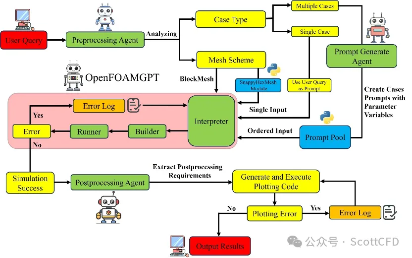

# 🌊 HydroAgent - 智能水文建模助手

[](https://www.python.org/downloads/)
[](https://opensource.org/licenses/MIT)
[](https://github.com/OuyangWenyu/hydromodel)

基于多智能体协作的下一代智能水文建模系统。HydroAgent 通过自然语言理解、自动配置生成、模型执行和结果分析，实现从用户意图到水文模拟的端到端自动化。

<div align="center">
  
</div>

---

## 🎯 核心特性

### 🧠 多智能体协作架构

HydroAgent 采用四层智能体架构，每个智能体专注于特定任务：

1. **IntentAgent（意图智能体）**
   - 🎯 自然语言理解和意图识别
   - 📝 模型、流域、算法参数提取
   - 🔍 动态提示词系统 + 算法参数Schema
   - ✅ 支持中英文混合输入

2. **ConfigAgent（配置智能体）**
   - ⚙️ 自动生成hydromodel配置
   - 🎛️ 智能参数映射和校验
   - 📊 支持多模型、多算法配置

3. **RunnerAgent（执行智能体）**
   - 🚀 执行水文模型率定、评估和模拟
   - 📈 实时进度显示（保留进度条，过滤冗余输出）
   - 🔄 自动执行率定后的测试期评估
   - 📁 结构化结果存储

4. **DeveloperAgent（分析智能体）**
   - 📊 自动分析率定和评估结果
   - 💡 提供模型性能诊断和改进建议
   - 📝 生成可读的分析报告

### ✨ 智能化功能

- **🎤 自然语言交互**：支持中文对话式任务描述
- **🧩 动态提示词管理**：基于Schema的上下文感知提示
- **🔄 自动化流程**：率定完成后自动评估，无需手动干预
- **📉 智能输出过滤**：终端只显示关键信息，完整日志保存到文件
- **🔌 多后端支持**：Ollama本地模型 / 通义千问API / OpenAI API
- **📦 模块化设计**：清晰的代码结构，易于扩展

---

## 📦 快速开始

### 系统要求

- **Python**: 3.11 或更高版本
- **操作系统**: Windows / Linux / macOS
- **内存**: 建议 8GB 以上
- **LLM后端**: Ollama (本地) 或 API密钥 (云端)

### 1️⃣ 环境安装

```bash
# 克隆仓库
git clone https://github.com/your-repo/HydroAgent.git
cd HydroAgent

# 安装 uv 包管理器（如未安装）
pip install uv

# 同步项目依赖
uv sync

# 激活虚拟环境
# Windows
.venv\Scripts\activate

# Linux/macOS
source .venv/bin/activate
```

### 2️⃣ 配置LLM后端

#### 选项A：通义千问API（推荐，快速稳定）

创建 `configs/definitions_private.py`：

```python
# API 密钥配置
OPENAI_API_KEY = "sk-your-qwen-api-key"
OPENAI_BASE_URL = "https://dashscope.aliyuncs.com/compatible-mode/v1"

# 项目路径
PROJECT_DIR = r"D:\project\Agent\HydroAgent"
DATASET_DIR = r"D:\project\data"
RESULT_DIR = r"D:\project\Agent\HydroAgent\results"
```

#### 选项B：Ollama本地模型

```bash
# 安装 Ollama (https://ollama.ai)
# 下载模型
ollama pull qwen2.5:7b
ollama pull granite3-dense:8b

# 启动 Ollama 服务（自动后台运行）
ollama serve
```

### 3️⃣ 数据准备

HydroAgent 使用 CAMELS 数据集，通过 `hydrodataset` 自动下载：

```python
# 首次运行时自动下载到 DATASET_DIR
# 或手动下载
from hydrodataset import Camels

camels = Camels(data_path="path/to/data")
camels.read_basin_data()
```

### 4️⃣ 运行示例

#### 交互式模式

```bash
# 使用 API 后端（推荐）
python scripts/run_developer_agent_pipeline.py --backend api

# 使用 Ollama 本地模型
python scripts/run_developer_agent_pipeline.py --backend ollama
```

**示例对话**：

```
请输入任务描述: 率定GR4J模型，流域01013500, 使用SCE-UA算法，算法迭代只需要500轮就行

✅ Intent分析完成
  意图: CALIBRATION
  模型: gr4j
  流域: 01013500
  算法: SCE_UA
  迭代轮数: rep=500

⚙️  Config生成完成
  训练期: 1985-10-01 to 1995-09-30
  测试期: 2005-10-01 to 2014-09-30

🚀 RunnerAgent执行中...
SCE-UA Progress: 100%|███████████| 500/500 [02:15<00:00, 3.7iter/s]

✅ 执行完成
  最优参数: x1=0.77, x2=0.00023, x3=0.30, x4=0.70
  测试期NSE: 0.65

📊 DeveloperAgent分析
  质量评估: 良好 (Good)
  建议: 模型性能合理，可考虑延长训练期或调整参数范围进一步优化
```

#### 单次查询模式

```bash
python scripts/run_developer_agent_pipeline.py --backend api "率定并评估XAJ模型，流域01013500"
```

---

## 🏗️ 系统架构

### 整体流程

```
用户输入（自然语言）
      ↓
IntentAgent (意图识别)
      ↓
ConfigAgent (配置生成)
      ↓
RunnerAgent (模型执行)
      ↓
DeveloperAgent (结果分析)
      ↓
分析报告 + 结果文件
```

### 目录结构

```
HydroAgent/
├── hydroagent/                 # 主包
│   ├── core/                   # 核心基础类
│   │   ├── base_agent.py       # Agent基类
│   │   └── llm_interface.py    # LLM接口封装
│   ├── agents/                 # 智能体实现
│   │   ├── intent_agent.py     # 意图识别
│   │   ├── config_agent.py     # 配置生成
│   │   ├── runner_agent.py     # 模型执行
│   │   └── developer_agent.py  # 结果分析
│   ├── utils/                  # 工具模块
│   │   └── prompt_manager.py   # 动态提示词管理
│   └── resources/              # 资源文件
│       └── algorithm_params_schema.txt  # 算法参数Schema
├── configs/                    # 配置目录
│   ├── definitions.py          # 公共配置模板
│   ├── definitions_private.py  # 私有配置（不提交）
│   └── config.py               # 全局参数
├── scripts/                    # 可执行脚本
│   ├── run_developer_agent_pipeline.py  # 4-Agent完整流程
│   └── run_agent.py            # 通用Agent入口（可扩展）
├── examples/                   # 示例代码
│   └── simple_workflow_example.py
├── test/                       # 测试文件
├── logs/                       # 日志目录
├── results/                    # 结果输出
└── README.md                   # 本文件
```

---

## 🚀 使用指南

### 支持的模型

- **GR 系列**: GR1Y, GR2M, GR4J, GR5J, GR6J
- **XAJ**: 新安江模型
- **更多模型**: 通过 hydromodel 扩展

### 支持的率定算法

| 算法 | 描述 | 主要参数 |
|------|------|----------|
| **SCE-UA** | Shuffled Complex Evolution | `rep` (迭代轮数), `ngs` (复合体数量) |
| **DE** | Differential Evolution | `max_generations`, `pop_size` |
| **PSO** | Particle Swarm Optimization | `max_iterations`, `swarm_size` |
| **GA** | Genetic Algorithm | `generations`, `population_size` |

### 算法参数智能识别

HydroAgent 的 IntentAgent 使用算法参数Schema，能够智能识别用户意图：

```python
# 用户输入
"率定GR4J模型，使用SCE-UA算法，迭代500轮"

# IntentAgent自动识别
{
    "intent": "calibration",
    "model": "gr4j",
    "algorithm": "SCE_UA",
    "extra_params": {
        "rep": 500  # ✅ 正确映射到SCE-UA的rep参数
    }
}
```

**支持的中文关键词**：
- 迭代轮数 / 迭代次数 / 轮 / 次 → `rep` (SCE-UA)
- 复合体数量 / 复合体个数 → `ngs` (SCE-UA)
- 种群大小 / 粒子数 → `pop_size` / `swarm_size`

### 输出文件结构

每次执行会在 `results/` 下创建时间戳目录：

```
results/
└── 20251121_210218/                    # 会话时间戳
    └── gr4j_SCE_UA_20251121_210222/    # 实验时间戳
        ├── calibration_results.json    # 率定结果（最优参数）
        ├── calibration_config.yaml     # 使用的配置
        ├── basins_metrics.csv          # 评估指标（NSE等）
        ├── basins_norm_params.csv      # 归一化参数
        ├── basins_denorm_params.csv    # 实际参数
        ├── param_range.yaml            # 参数范围
        └── gr4j_evaluation_results.nc  # 评估结果（NetCDF）
```

### 日志系统

所有执行日志自动保存到 `logs/` 目录：

```
logs/
├── run_developer_agent_pipeline_20251121_210217.log  # 完整执行日志
└── test_*.log                                         # 测试日志
```

**日志内容包括**：
- LLM调用详情（提示词、响应、耗时）
- Agent状态转换
- hydromodel完整输出（包括被过滤的装饰性输出）
- 错误堆栈信息

---

## 🔧 高级配置

### 自定义提示词

修改 `hydroagent/resources/algorithm_params_schema.txt` 来添加新的算法参数映射：

```
## Your_Algorithm
Parameters:
- **your_param** (type): Description
  - User keywords: "关键词1", "关键词2"
  - Example: "迭代100次" → your_param=100
```

### 修改全局参数

编辑 `configs/config.py`：

```python
# LLM配置
DEFAULT_MODEL = "qwen-turbo"
TEMPERATURE = 0.1

# 数据配置
DEFAULT_TRAIN_PERIOD = ["1985-10-01", "1995-09-30"]
DEFAULT_TEST_PERIOD = ["2005-10-01", "2014-09-30"]

# 算法默认参数
DEFAULT_SCE_UA_PARAMS = {
    "rep": 1000,
    "ngs": 300,
    "kstop": 500,
}
```

### 输出显示控制

在 `runner_agent.py` 中修改过滤模式：

```python
filter_patterns = [
    "🚀 =====",      # 过滤分隔线
    "📋 SCE-UA",     # 过滤参数详情
    # 添加更多过滤模式...
]
```

**Tips**：进度条 (`SCE-UA Progress:`) 会始终显示，因为它使用 `\r` 更新。

---

## 🧪 开发与测试

### 运行测试

```bash
# 测试意图识别
python test/test_intent_agent.py --backend api

# 测试配置生成
python test/test_config_agent.py

# 测试完整流程
python test/test_developer_agent_pipeline.py

# 测试统一工具
python test/test_unified_tools.py
```

### 添加新Agent

1. 在 `hydroagent/agents/` 创建新Agent类，继承 `BaseAgent`
2. 实现 `process()` 方法
3. 在管道脚本中集成新Agent

```python
from hydroagent.core.base_agent import BaseAgent

class YourAgent(BaseAgent):
    def process(self, input_data):
        # 实现逻辑
        return result
```

### 贡献指南

1. Fork 本仓库
2. 创建特性分支 (`git checkout -b feature/AmazingFeature`)
3. 提交更改 (`git commit -m 'Add some AmazingFeature'`)
4. 推送到分支 (`git push origin feature/AmazingFeature`)
5. 开启 Pull Request

**代码规范**：
- 遵循 PEP 8
- 所有新文件添加标准文件头（见 `CLAUDE.md`）
- 测试文件必须包含日志配置
- 配置文件使用 `configs/definitions_private.py`

---

## 🗺️ 路线图

### ✅ 已完成

- [x] 4-Agent协作架构
- [x] 动态提示词系统
- [x] 算法参数智能识别
- [x] 自动评估流程
- [x] 智能输出过滤
- [x] 多后端LLM支持

### 🚧 进行中

- [ ] RAG知识库集成（hydroagent/knowledge/）
- [ ] 可视化结果展示
- [ ] 多流域并行处理

### 📅 计划中

- [ ] Web界面（Gradio/Streamlit）
- [ ] 模型性能对比分析
- [ ] 参数敏感性分析
- [ ] 自定义工作流编排
- [ ] 模型集成预测
- [ ] Docker容器化部署
- [ ] 云端协作功能

---

## 📚 文档与资源

### 相关文档

- **用户指南**: 查看 `CLAUDE.md` 了解开发规范
- **API文档**: 使用 `pdoc` 生成 (`pdoc hydroagent --html`)
- **hydromodel文档**: [GitHub](https://github.com/OuyangWenyu/hydromodel)

### 学术引用

如果您在研究中使用了 HydroAgent，请引用：

```bibtex
@software{hydroagent2024,
  title = {HydroAgent: An Intelligent Multi-Agent System for Hydrological Modeling},
  author = {Your Name},
  year = {2024},
  url = {https://github.com/your-repo/HydroAgent}
}
```

### 依赖项目

- **[hydromodel](https://github.com/OuyangWenyu/hydromodel)**: 水文模型核心库
- **[hydrodataset](https://github.com/OuyangWenyu/hydrodataset)**: 水文数据集管理
- **[hydroutils](https://github.com/OuyangWenyu/hydroutils)**: 水文工具函数

---

## 🤝 支持与反馈

### 问题反馈

遇到问题？请通过以下方式反馈：

1. **GitHub Issues**: [提交Issue](https://github.com/your-repo/HydroAgent/issues)
2. **讨论区**: [GitHub Discussions](https://github.com/your-repo/HydroAgent/discussions)

### 常见问题

**Q: 为什么IntentAgent识别失败返回 UNKNOWN？**

A: 检查以下几点：
- LLM后端是否正常连接（查看日志中的 `HTTP Request` 状态）
- API密钥是否正确配置在 `definitions_private.py`
- 查询是否包含模型名称、流域ID等关键信息

**Q: 率定很慢怎么办？**

A: 可以减少迭代轮数，例如：
```
率定GR4J模型，流域01013500，算法迭代100轮即可
```

**Q: 如何查看完整的hydromodel输出？**

A: 查看日志文件 `logs/run_developer_agent_pipeline_*.log`，包含所有完整输出。

**Q: 支持哪些LLM模型？**

A:
- **通义千问**: qwen-turbo, qwen-plus, qwen-max (推荐)
- **OpenAI**: gpt-4, gpt-3.5-turbo
- **Ollama本地**: qwen2.5:7b, granite3-dense:8b 等

---

## 📄 许可证

本项目采用 MIT 许可证 - 详见 [LICENSE](LICENSE) 文件。

---

## 🌟 致谢

感谢以下项目和贡献者：

- **[hydromodel](https://github.com/OuyangWenyu/hydromodel)** by Wenyu Ouyang - 提供核心水文模拟能力
- **[LangChain](https://github.com/langchain-ai/langchain)** - AI应用框架（可选集成）
- **[Alibaba Cloud](https://www.aliyun.com/product/dashscope)** - 通义千问API服务
- **[Ollama](https://ollama.ai/)** - 本地模型服务

---

<div align="center">

**🌊 让水文建模更智能，让科研更高效 🌊**

[⬆ 返回顶部](#-hydroagent---智能水文建模助手)

</div>
