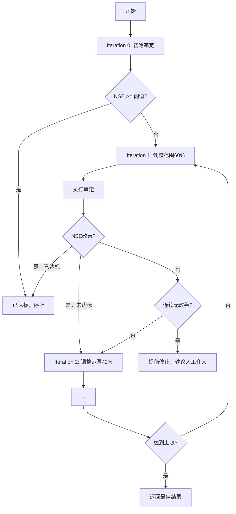

# 自适应迭代优化功能说明

## 📋 功能概述

HydroAgent 支持**自适应迭代优化**，能够自动调整参数搜索范围，逐步提升率定精度，直到达到目标NSE阈值或达到迭代上限。

---

## 🚀 核心特性

### 1. **动态缩放策略**
每次迭代自动调整参数范围缩放比例：

| 迭代次数 | 缩放比例 | 说明 |
|---------|---------|------|
| Iteration 0 | 100% | 初始率定（使用默认范围） |
| Iteration 1 | 60% | 第1次优化 |
| Iteration 2 | 42% | 第2次优化（0.6 × 0.7） |
| Iteration 3 | 29% | 第3次优化（0.6 × 0.7²） |
| Iteration 4 | 21% | 第4次优化（0.6 × 0.7³） |
| Iteration 5 | 15% | 第5次优化（0.6 × 0.7⁴） |

**公式**：`range_scale = initial_scale × (0.7 ^ iteration)`，最小不低于10%

---

### 2. **智能停止条件**

系统会在以下情况下自动停止迭代：

#### ✅ 成功停止
- **NSE达标**：当 NSE ≥ 阈值（默认0.5）时停止
- **状态码**：`converged`

#### ⚠️ 提前停止
- **连续无改善**：连续2次迭代NSE改善 < 最小改善幅度（默认0.01）
- **状态码**：`no_improvement`
- **建议**：人工检查参数范围或模型配置

#### ⏱️ 达到上限
- **最大迭代次数**：达到5次迭代（可配置）
- **状态码**：`max_iterations_reached`（未达标）或 `converged_at_max`（已达标）

---

### 3. **以最佳参数为中心**

每次迭代都会：
1. 读取上一次的最佳参数（`basins_denorm_params.csv`）
2. 以最佳参数为中心点
3. 按缩放比例计算新范围
4. 确保不超出物理范围

**示例**（GR4J模型的x1参数）：
```
Iteration 0:
  原始范围: [100, 1500]  (长度: 1400)
  最佳参数: 350

Iteration 1 (scale=60%):
  新范围: [100, 940]     (长度: 840, 以350为中心)
  最佳参数: 420

Iteration 2 (scale=42%):
  新范围: [238, 602]     (长度: 364, 以420为中心)
  最佳参数: 450

Iteration 3 (scale=29%):
  新范围: [348, 552]     (长度: 204, 以450为中心)
  最佳参数: 465
```

---

## 🛠️ 配置参数

在 `InterpreterAgent` 或 `TaskPlanner` 生成的 config 中，可以通过 `parameters` 字段配置：

```python
parameters = {
    "task_type": "boundary_check_recalibration",
    "max_iterations": 5,           # 最大迭代次数（默认5）
    "nse_threshold": 0.5,          # NSE达标阈值（默认0.5）
    "min_nse_improvement": 0.01,   # 最小改善幅度（默认0.01）
    "initial_range_scale": 0.6,    # 初始缩放比例（默认0.6）
    "boundary_threshold": 0.05     # 边界阈值（默认0.05，未使用）
}
```

---

## 📊 返回结果

### 成功收敛（converged）
```json
{
    "status": "converged",
    "iterations": [
        {"iteration": 0, "nse": 0.45, "status": "completed"},
        {"iteration": 1, "nse": 0.52, "nse_improvement": 0.07, "range_scale": 0.6}
    ],
    "total_iterations": 1,
    "best_iteration": 1,
    "final_nse": 0.52,
    "final_metrics": {"NSE": 0.52, "RMSE": 1.2, ...},
    "message": "Converged at iteration 1 with NSE 0.52"
}
```

### 无改善（no_improvement）
```json
{
    "status": "no_improvement",
    "iterations": [...],
    "total_iterations": 3,
    "best_iteration": 1,
    "final_nse": 0.48,
    "message": "No improvement after 2 iterations. Best NSE: 0.48 at iteration 1",
    "recommendation": "建议人工设置更合理的参数范围或检查模型配置"
}
```

### 达到上限（max_iterations_reached）
```json
{
    "status": "max_iterations_reached",
    "iterations": [...],
    "total_iterations": 5,
    "best_iteration": 3,
    "final_nse": 0.47,
    "message": "Reached max iterations. Best NSE: 0.47 at iteration 3",
    "recommendation": "建议人工设置更合理的参数范围或检查模型配置"
}
```

---

## 🔍 工作流程



---

## 💡 使用示例

### 实验3查询
```
"率定流域 01013500，如果参数收敛到边界，自动调整范围重新率定"
```

### 预期行为
1. IntentAgent 识别为 `task_type="iterative"`
2. TaskPlanner 拆解为2个子任务：
   - task_1: 初始率定
   - task_2: 自适应迭代优化（`task_type="boundary_check_recalibration"`）
3. RunnerAgent 执行迭代优化
4. DeveloperAgent 分析最终结果

---

## ⚙️ 实现细节

### 文件依赖
```
上一次率定结果目录/
├── param_range.yaml           # 参数范围（hydromodel自动生成）
├── basins_denorm_params.csv   # 最佳参数（反归一化）
└── calibration_results.json   # 率定结果
```

### 核心方法
- `RunnerAgent._run_boundary_check_recalibration()`: 迭代优化主流程
- `RunnerAgent.adjust_param_range_from_previous_calibration()`: 参数范围调整

---

## 📈 性能优化建议

### 第一次率定（粗搜索）
```python
training_cfgs = {
    "algorithm": "SCE_UA",
    "rep": 500,        # 低迭代次数
    "ngs": 100,        # 较少复合体
    ...
}
```

### 后续率定（精搜索）
```python
training_cfgs = {
    "algorithm": "SCE_UA",
    "rep": 1000,       # 增加迭代次数
    "ngs": 200,        # 增加复合体
    ...
}
```

---

## 🎯 适用场景

✅ **适合使用迭代优化**：
- 初始NSE较低（< 0.5），需要精细调优
- 参数收敛到边界，需要扩展搜索范围
- 对模型精度要求较高

❌ **不适合使用**：
- 初始NSE已经很高（> 0.7），无需优化
- 数据质量差，模型结构不合适
- 参数范围设置完全错误（需要人工重新设定）

---

## 🔧 调试技巧

### 查看迭代历史
每次迭代的详细信息都保存在返回结果的 `iterations` 数组中：
```python
for iter_info in result["iterations"]:
    print(f"Iteration {iter_info['iteration']}:")
    print(f"  NSE: {iter_info['nse']}")
    print(f"  Range scale: {iter_info.get('range_scale')}")
    print(f"  Calibration dir: {iter_info['calibration_dir']}")
```

### 查看参数范围变化
检查每次生成的 `param_range_iter{N}.yaml` 文件：
```bash
workspace_dir/
├── param_range_iter1.yaml
├── param_range_iter2.yaml
├── param_range_iter3.yaml
...
```

---

**最后更新**: 2025-01-23
**版本**: v1.0
